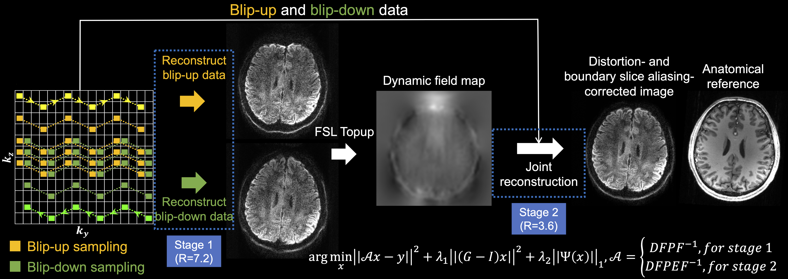

# Sampling strategies and integrated reconstruction for reducing distortion and boundary slice aliasing in high-resolution 3D diffusion MRI
MATLAB implementation of distortion-free parallel imaging reconstruction for 3D multi-slab diffusion MRI

## 1. Framework

**Figure 1. Proposed framework.** The proposed sampling pattern with kz blipped-CAIPI and complementary partial Fourier for blip-up (yellow) and blip-down (green) data and the two-stage reconstruction. The trajectory of one shot of the multi-shot sampling is marked in bright yellow and bright green for blip-up and blip-down sampling with arrows indicating the phase encoding direction. The forward operator A in the reconstruction includes Fourier Transform F and inverse Fourier Transform F^(-1), the phase modulation P representing motion-induced phase errors measured by 2D navigators, k-space sampling operation D in both stages 1 and 2, and an additional distortion operation E (captured by the field map) for stage 2. Example images are from a single volume diffusion MRI dataset (1.05 mm isotropic resolution) of a representative subject, with anatomical image listed for reference (acquired with MPRAGE at 0.86 mm isotropic resolution).

## 2. Reconstruction

The cost function of the SPIRiT-based regularized reconstruction is:

$$ ‖Ax-y‖_2^2+λ_1 ‖(G-I)x‖_2^2+λ_2 ‖Ψ(x)‖_1 $$

where x is the multi-coil k-space data of the target aliasing- and distortion-corrected image, A is the forward operator, y is the acquired data, G is the SPIRiT kernel trained on coil calibration data, I is the identity matrix, Ψ is the wavelet operator, and $λ_1$ and $λ_2$ are the parameters for the SPIRiT and sparsity regularizations (the SPIRiT weights for stage 1 and stage 2 are denoted as $λ_{1,1}$ and $λ_{1,2}$, respectively). The SPIRiT regularization ($λ_1$) facilitates parallel imaging by enforcing calibration consistency between every k space data point and its neighbors, while the sparsity regularization ($λ_2$) is used to suppress the noise.  

The forward operator A is constructed differently for the two stages:

$$A=DFPF^{-1}, \space \text{for stage 1} $$

$$A=DFPEF^{-1}, \space \text{for stage 2}$$

where D is the down-sampling operator in k-space, $F$ and $F^{-1}$ are the Fourier Transform and inverse Fourier Transform, respectively, and P represents motion-induced phase errors captured by 2D navigators. The E operator is only applied in stage 2 and represents spatial distortion induced by field inhomogeneity estimated from the stage 1 reconstruction.

It is worth noting that unlike the original SPIRiT formulation in which data consistency can be ensured implicitly by only estimating the missing k-space points, in our work the entire k-space needs to be estimated. This is because in our forward operator A the acquired k-space points are corrupted by the motion-induced phase P and the distortion-induced displacement E, and are therefore different from those in the uncorrupted target k-space data x. Hence, the SPIRiT constraint is explicitly added as a regularization term and the data consistency term $‖Ax-y‖_2^2$ imposes the consistency constraint across all k-space points.

## 3. Tutorial

- The reconstruction is implemented in MATLAB in this resporitory. Please download the code and run *stage1_reconstruction.m* and *stage2_reconstruction.m* to get the result for each stage of reconstruction.

- To run the code, please also download the data from https://git.fmrib.ox.ac.uk/fmz664/distortion-free-3d-dmri/-/tree/main/data, which is a single-slab 3D diffusion MRI at 1.22mm isotropic resolution acquired with the proposed sampling.

## 4. Reference

[1] Li Z, Miller KL, Andersson JLR, Zhang J, Liu S, Guo H, Wu W. Sampling strategies and integrated reconstruction for reducing distortion and boundary slice aliasing in high-resolution 3D diffusion MRI. 2023; bioRxiv. (Accepted at *Magnetic Resonance in Medicine*, in press, https://www.biorxiv.org/content/10.1101/2023.01.11.523645v1)

[2] Li Z, Miller KL, Wu W. Integration of blip reversal with CAIPI sampling enables simultaneous correction of slice aliasing and distortion in 3D multi-slab diffusion MRI. The Annual Meeting of ISMRM, London, 2022. (Oral Power Pitch)
